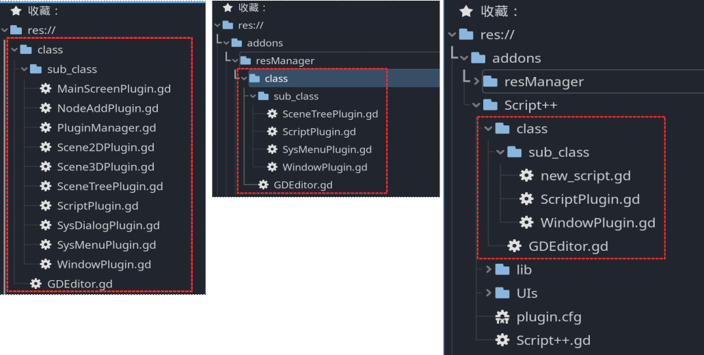

# Godot4-GDEditor
Godot4.0编辑器插件核心库，方便开发各种编辑器插件

## 概述

笔者从Godot3.4开始学习Godot编辑器插件开发，并逐渐积累和编写了一套方便与插件开发的类和静态函数。

当然这其中也少不了像张学徒(Bilibili@学徒的小窝)这样的指引。

在Godot4.0开始，逐步基于类的继承重写了一套编辑器插件核心类。

本代码仓库就用于维护这套核心库的类和文档，以方便更多Godot编辑器开发者上手使用。

### 选择使用

`GDEditor`本身是一个继承自GDScript原生插件类`EditorPlugin`的自定义类，`GDEditor`和其子类共同构成了本核心库。

此库包含众多子类，实际开发是指需要包含主要的`GDEditor`和必须使用的子类，其余类可以删除。

如下图，左一是`GDEditor`核心库的全部类，而中间和右侧分别是插件项目resManager和Script++中的实际使用的类。



### 使用非全局引用

`GDEditor`及其子类全部采用非全局申明形式，也就是不使用`class_name`将类申明为全局类，在继承父类时也采用路径形式。

这样的好处是不会产生多个基于本类库开发的插件在同一Godot项目中使用时发生类名的冲突。

以`ScriptPlugin`子类为例，可以看到它继承`GDEditor`时采用了路径字符串形式。并注释掉了`class_name`形式的申明。

```swift
@tool
extends "../GDEditor.gd"
#class_name ScriptPlugin

...
```

实际创建插件时，可以直接继承自子类。

如下：Script++插件主要是对Godot脚本编辑器进行扩展，所以直接继承自`ScriptPlugin.gd`即可。

```swift
# ========================================================
# 名称：Script++
# 类型：编辑器插件 GDEditor扩展类型
# ...
# ========================================================

@tool
extends "class/sub_class/ScriptPlugin.gd"

...
```

## 文档

### 主类

- [GDEditor](docs\GDEditor.md) 继承自`EditorPlugin`，提供编辑器基础的接口。方便引用编辑器界面元素。

### 子类

- [MainScreenPlugin](docs\MainScreenPlugin.md) 方便创建主屏幕插件

- [NodeAddPlugin](docs\NodeAddPlugin.md) 
-  [PluginManager](docs\PluginManager.md) 
-  [Scene2DPlugin](docs\Scene2DPlugin.md) 
-  [Scene3DPlugin](docs\Scene3DPlugin.md) 
-  [SceneTreePlugin](docs\SceneTreePlugin.md) 用于“场景”面板相关插件开发
-  [ScriptPlugin](docs\ScriptPlugin.md) 用于脚本编辑器插件开发的类
-  [SysDialogPlugin](docs\SysDialogPlugin.md) 
-  [SysMenuPlugin](docs\SysMenuPlugin.md) 
-  [WindowPlugin](docs\WindowPlugin.md) 

### 补充

-  [创建全屏插件](docs\创建全屏插件.md) 
-  [基本原理](docs\基本原理.md) 